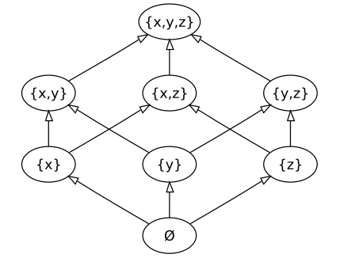

---
# You can also start simply with 'default'
theme: seriph
themeConfig:
  primary: '#069494'

# random image from a curated Unsplash collection by Anthony
# like them? see https://unsplash.com/collections/94734566/slidev
background: https://cover.sli.dev
# some information about your slides (markdown enabled)
title: Дискретная математика, практика 1
info: |
  ## Презентация для первой практики
# apply unocss classes to the current slide
# background: https://cover.sli.dev
# https://sli.dev/features/drawing
drawings:
  persist: false
# slide transition: https://sli.dev/guide/animations.html#slide-transitions
transition: slide-left
# enable MDC Syntax: https://sli.dev/features/mdc
mdc: true
# open graph
seoMeta:
  # By default, Slidev will use ./og-image.png if it exists,
  # or generate one from the first slide if not found.
  # ogImage: auto
  ogImage: https://cover.sli.dev
fonts:
  sans: Robot
  mono: JetBrains Mono
favicon: /graph.svg
---

## Практика по дискретной математике 1

---
layout: image-right
image: /qrCode.png
---

# Представлюсь

Ефим Алексеевич Кубышкин

- Сейчас студент магистратуры
- Заканчивал ТехПрог
- tg: [@EfKub](https://tg.me/EfKub) (если очень нужен)
- email: st098235@student.spbu.ru (если не срочно, но формально)

---

# Цели курса

Зачем и что мы делаем

<v-clicks at="1"> 

- Дать минимальную математическую культуру
  - Математика сложная, а мы не математики $\Rightarrow$ надо прощупать на простом
  - Программистская интуиция, чтобы упростить понимание. Но с соблюдением формальностей
- Познакомить с базой
  - Дальше будут предполагать (преподаватели, работодатели), что вы знаете некоторые алгоритмы и определения
  - Кирпичики, из которых строится нечто большее, не освоите это -- дальше будет беда
</v-clicks>

<v-click at="3">

## Дискретная математика -- самая применимая математика для программиста, Вам придётся её знать, если хотите расти как специалист
</v-click>

---

# Базовые операции над множествами
 

Какие знаете?
<v-click>

1. Объединение (union) $A \cup B$ <v-click at="2"> $= \{ x \mid x \in A \lor x \in B \}$ </v-click>
2. Пересечение (intersection) $A \cap B$ <v-click at="3"> $= \{ x \mid x \in A \land x \in B \}$ </v-click>
3. Разность (difference, subtraction) $A \setminus B$ <v-click at="4"> $= \{ x \mid x \in A \land x \notin B \}$ </v-click>
4. Симметрическая разность (symmetric difference) $A \Delta B$ <v-click at="5"> $= \{ x \mid (x \in A \cup B) \land (x \notin A \cap B) \}$ </v-click>
5. Декартово произведение (cartesian product) $A \times B$ <v-click at="6"> $= \{ (x, y) \mid x \in A ,\  y \in B \}$ </v-click>
6. Дополнение до универсума (complement) $A^c$ или $\overline{A}$ <v-click at="7"> $= \{ x \mid x \notin A \land x \in \mathbb{U} \}$ </v-click>
7. Булеан, множество подмножеств (powerset) $2^A$ или $P(A)$ <v-click at="8"> $= \{ X \mid X \subseteq A \}$ </v-click>
</v-click>

---

# Пустое множество

И как перестать его бояться

Пустое множество $\varnothing$ -- множество без элементов

<v-click>

Как будут выглядеть следующие множества?

- $2^{\varnothing}$ <v-click at="2"> $= \{ \varnothing \}$ </v-click>
- $2^{2^{\varnothing}}$ <v-click at="3"> $=\{ \varnothing, \{\varnothing\} \}$ </v-click>
- $2^{2^{2^{\varnothing}}}$ <v-click at="4"> $=\{ \varnothing, \{\varnothing\}, \{\varnothing, \{\varnothing\}\}, \{ \ \{ \varnothing \}  \} \ \}$ </v-click>
</v-click>

---

# Отношения

Как выражать интуитивно понятные вещи на теории множеств

Пусть $X_1, X_2, \dots, X_n$ -- непустые множества, тогда
**Отношение** -- это любое подмножество их декартового произведения $R \subset X_1 \times X_2 \times \dots \times X_n$

<v-click>

Примеры

1. "Больше или равно" над натуральными числами $a \geq b \Leftrightarrow (a, b) \in \mathbb{N}\times\mathbb{N}$
2. "Являются базисом" над $n$-мерным пространством $R \subset \mathbb{R}^n \times \dots \times \mathbb{R}^n$
3. "Образуют квадрат" над плоскостью
</v-click>

---

# Бинарные отношения

Вечная классика

Бинарное отношение -- это отношение на декартовом квадрате $R \subset X\times X$, обычно, если $x$ и $y$ находятся в отношении, то пишут $xRy$ (инфиксная запись)

<v-click>

Важные типы отношений

1. Рефлексивное: $\forall x \ : \ xRx$
2. Симметричное: $\forall x, y \ : \ xRy \to yRx$
3. Транзитивное: $\forall x, y, z \ : \ xRy \land yRz \to xRz$
4. Асимметричное: $\forall x, y \ : \ xRy \to \lnot (yRx)$
5. Иррефлексивное: $\forall x \ : \ \lnot (xRx)$
6. Антисимметричное: $\forall x, y \ : \ xRy \land yRx \to x = y$
7. Эквивалентное: рефлексивность + симметричность + транзитивность
8. Отношение частичного порядка: рефлексивность + антисимметричность + транзитивность
9. Линейно упорядоченное множество: частично упорядоченное множество +  $\forall x, y \ : \ xRy \lor yRx$
</v-click>

---

# Частично упорядоченные множества
 

Некоторые примеры

<v-click at="1">

- $\langle \mathbb{N}, \leq \rangle , \langle \mathbb{R} , \leq \rangle$ -- числа с "обычным" порядком
- $\langle \mathbb{N}, \mid \rangle, \langle \mathbb{N}, \vdots \rangle$ -- отношение делимости на натуральных числах
- Лексикографический порядок
- Отношение "быть подстрокой"
- $\langle 2^X, \subset \rangle$ --  булеан любого множества естественно упорядочен отношением включения
- DAG — Directed Acyclic Graph — направленный ациклический граф. Отношение заведем такое: если из одной вершины можно дойти по стрелочкам до другой, то мы будет говорить, что они находятся в отношении достижимости
</v-click>

---

# Диаграммы Хассе
 

Диаграмма Хассе -- представление конечного частично упорядоченного множества в виде рисунка его транзитивного сокращения. Проще: элементы множества -- узлы, рисуем между ними стрелки только если они находятся в отношении, а лишние стрелки, которые гарантированы рефлексивностью и транзитивностью не рисуем

Упражнения

- $\lang P(\{ \varnothing, \{ \varnothing \} \}), \subset \rang$
- $\lang \{1, 2, 3, 4, 5, 6\}, \mid \rang$

Пример для $\lang P(\{x, y, z\}), \subset \rangle$

<!--  -->

---

# Функции

Да, не просто "соответствие"

Отображение (тоже самое, что и функция) из $X$ в $Y$ ($f : X \to Y$) -- это кортеж $\lang X, Y, R \rang$, где

- $X$ -- домен
- $Y$ -- кодомен
- $R$ -- график: отношение на $X \times Y$, такое что $\forall x \in X \ \exists ! y \in Y \ : \ xRy$

<v-click at="1"> 

Что тогда означает тогда запись $f(x) = y$ ? 
</v-click> 

<v-click at="2">
Каверзные примеры

- Функции $id_1 : \mathbb{N} \to \mathbb{N}$ и $id_2 : \mathbb{N} \to \mathbb{R}$, которые работают одинаково $\forall x \in \mathbb{N} \ id_1(x) = id_2(x) = x$
- Если домен или кодомен является пустым множеством
</v-click>

---

# Важные типы отношений
 

Отношение $f: X \to Y$

- Инъективное: <v-click at="1"> $\forall x_1 \in X \ \forall x_2 \in X \ : \ f(x_1) = f(x_2) \to x_1 = x_2$ </v-click>
- Сюрьективное: <v-click at="2"> $\forall y \in Y \ \exists x \in X \ : f(x) = y$ </v-click>
- Биективное: инъективное + сюръективное<v-click at="3">, или $\forall y \in Y \ \exists ! x \in X \ : \ f(x) = y$ </v-click>

---

# Чуть-чуть про доказательства

Мышцы математики

Как можно доказывать какие-то утверждения?

<v-clicks at="1">

- По определению. "Почему НОД двух разных простых чисел равен $1$? По определению!!"
- От противного. "Почему $\sqrt 2$ иррационален? Ну, давайте предположим, что оно рационально..."
- Применить идею. "Как доказать теорему Пифогора? Заметим, что если достроить до квадрата..."
- По индукции (или как очень формально сказать "и так далее"). "Докажите, что сумма первых $n$ чисел равна $\frac{n (n - 1)}{2}$. Давайте посмотрим на простые случаи, убедимся, что паттерн сохранятся, и скажем "и так далее"
</v-clicks>

<v-click at="5">

Формально, математическая индукция -- это аксиома (вообще, схема аксиом), которая формулируется так:

Для всякого свойства $P$ верно
$$
(P(0) \land (\forall n \in \mathbb{N} \ P(n) \to P(n + 1))) \to \forall n \in \mathbb{N} \ P(n)
$$
</v-click>

---
layout: image
image: /qr-code-group.png
backgroundSize: contain
---
