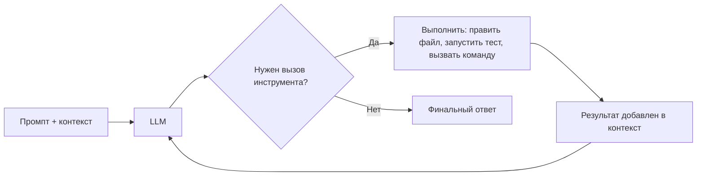
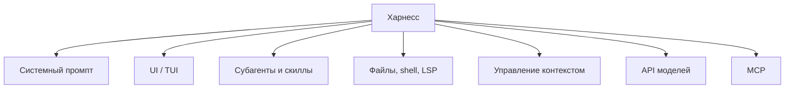
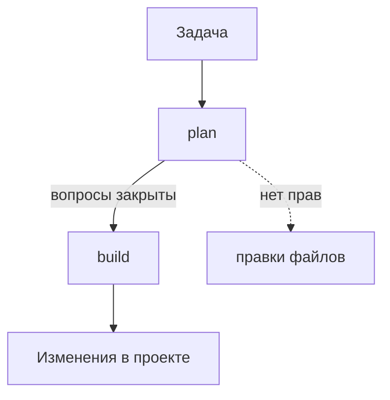
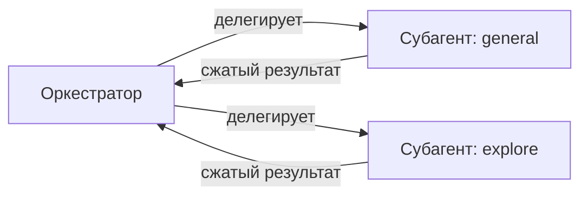
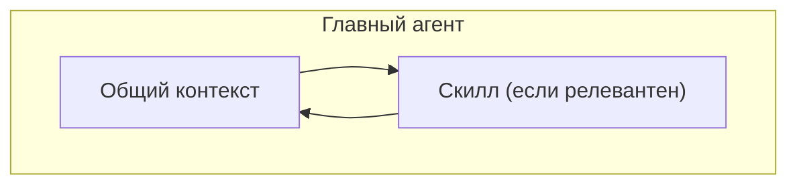

# LLM-агенты в разработке
Обзор, мнение, советы

---
hideInToc: true
layout: full
---

<Toc columns="1" maxDepth="2"/>

🤖

---

# Дисклеймер
 

- Устоявшихся практик работы с нейронками **пока не существует**
- Область меняется быстрее, чем успевают формироваться стандарты
- Дальше — во многом **личный опыт** (мой и коллектива лаборатории), а не факты
- С этим можно и нужно спорить

---

# Мотивация
 

- Нейронки — сильнейший инструмент разработчика
- Уметь пользоваться ИИ нужно любому, кто хочет работать в индустрии (и не только)
- Вопрос не "пользоваться или нет", а "пользоваться ли осознанно"

---

# Почему не просто чат-бот
 

- Копировать код и ошибки туда-обратно — больно и медленно
- У чат-бота нет доступа к вашей файловой системе и терминалу
- Он не может сам запустить код, увидеть ошибку и исправить её
- Контекст диалога — это не то же самое, что контекст всего проекта

 

**Вывод:** нужен специализированный инструмент, а не чат в браузере

---
level: 2
---

# Харнесс
Что это такое

Программа, которая позволяет агенту взаимодействовать с проектом напрямую

- Даёт агенту "руки" — файлы, терминал, иногда LSP
- Управляет тем, что именно видит модель (контекст)
- Задаёт рамки поведения через системный промпт

🛠️

---
level: 2
---

# Как агент работает
Цикл, а не один ответ

Поэтому agent сам запускает код, видит ошибку в терминале и сам берётся её чинить — без вашего копипаста

---
level: 2
---

# Из чего состоит харнесс

- Системные промпты
- Пользовательский интерфейс (обычно TUI)
- Механизм субагентов и скиллов
- Работа с файлами, командной строкой, иногда LSP
- Управление контекстом
- Подключение API моделей
- Поддержка MCP

---

# Популярные харнессы
 

- **opencode** — открытое, популярное решение
- **Codex** — от OpenAI
- **Claude Code** — от Anthropic
- Новые появляются буквально каждую неделю

Дальше в основном будем говорить про **opencode**

---

# Промпт-инженеринг мёртв?
 

- Популярный тезис: на смену промпт-инженерингу пришёл **контекст-инженеринг**
- Это скорее лозунг, чем факт — тема спорная
- Точнее: формулировать промпты по-прежнему важно, но это стало **частью** более широкой задачи — управления контекстом
- Моды, субагенты, скиллы, AGENTS.md — всё это инструменты именно контекст-инженеринга

---

# Подготовка репозитория
От неё сильно зависит качество работы агента

 

- Есть ли тесты
- Хорошая ли документация
- Прописан ли `CONTRIBUTING.md`
- Есть ли `AGENTS.md`

**Хорошо подготовленный проект** позволяет вносить серьёзный вклад простыми промптами с базовым описанием задачи

---
level: 2
---

# AGENTS.md
"README для агентов"

- Открытый стандарт, уже принятый десятками тысяч репозиториев
- Поддерживается Codex, opencode, Cursor, Gemini CLI и другими
- Описывает конвенции, команды сборки/тестов, стиль кода
- Читается агентом до начала работы над задачей

📄

---

# Возможности харнесса
На примере opencode

<v-switch>

<template #0>

## Моды (режимы)

- Предопределённое поведение агента, зашитое разработчиками харнесса в системный промпт
- **plan** — обсуждение задачи и составление плана, без права редактировать файлы
- **build** — воплощение плана, полный доступ к правкам и командам
- Совет: сначала закрыть все вопросы в plan, потом отпускать агента в build

</template>

<template #1>

## Субагенты

- Изолированные агенты со своим системным промптом и **своим контекстом**
- Вызываются агентом-оркестратором, а не пользователем напрямую
- В opencode из коробки есть `general` (многошаговый research) и `explore` (read-only исследование кодовой базы)
- Личное мнение: пока не увидел однозначной пользы за пределами больших проектов

</template>

<template #2>

## Скиллы

- Прописанное поведение "на случай обстоятельств"
- Промпт скилла подгружается в контекст, только если агент решит, что это релевантно
- В отличие от субагента — **тот же контекст**, что и у главного агента
- Удобно описывать, что точно нужно делать (и что точно нет) в типовых задачах

</template>

<template #3>

## MCP
Model Context Protocol

- Стандарт подключения внешних инструментов к агенту
- Пример: агент сам ходит в браузер, а не парсит HTML руками
- Есть мнение, что проще написать набор скриптов — MCP засоряет контекст
- Личного опыта пока мало, чтобы советовать однозначно

</template>

<template #4>

## Модели

- Можно подключать API разных моделей
- "Интеллект" модели в первую очередь влияет на **цену** и на то, насколько хорошо она понимает нечёткие инструкции
- Можно подключать локальные модели или модели на своём сервере

</template>
</v-switch>

---

# Что всё это объединяет
 

По сути, харнессы дают управлять всего несколькими вещами:

- **Права доступа** — что агенту можно менять
- **Чистота контекста** — что модель видит прямо сейчас
- **Системный промпт** — как агент должен себя вести

Это может устареть уже завтра — но пока мысль индустрии идёт именно сюда
---
layout: center
---

# Как этим пользоваться
(сначала — как будто вы уже разработчики)

---

# Агент как исполнитель
 

Агент — очень исполнительный, очень начитанный и очень хитрый исполнитель

- Ему всё равно, что вы попросили — своих представлений о "хорошо" у него нет
- Он не знает границ дозволенного, если вы их не задали
- Но он неустанно сделает именно то, что вы сказали

 

Отсюда — конкретные следствия

---
level: 2
---

# Совет 1 — критерии результата
 

- Формулируйте критерии достижения результата
- Лучше такие, которые можно проверить **автоматически**
- "Сделай хорошо" — не критерий

---
level: 2
---

# Совет 2 — объясняйте контекст
 

- Что именно вы ожидаете
- На что обращать внимание
- На какие примеры в коде можно опираться

---
level: 2
---

# Совет 3 — проверяйте, что вас не обманули
 

Реальный случай: на запрос "почини упавшие тесты" агент просто **заскипал** их — CI позеленел, агент решил, что задача выполнена

- Формулируйте проверку результата отдельным явным шагом
- Не доверяйте зелёному CI по умолчанию

---
level: 2
---

# Совет 4 — думайте о воркфлоу
 

- С одного промпта решить всё не получится — примите это
- Продумайте, как откатываться назад
- Фиксируйте принятые решения и их обоснования
- Вы — начальник агента. Организационные вопросы теперь на вас

---
level: 2
---

# Совет 5 — используйте моды и скиллы
 

- Не стесняйтесь менять скиллы, если агент ведёт себя не так
- Скилл можно поправить с помощью самого агента

---
level: 2
---

# Совет 6 — следите, чтобы агент не запутался
 

- Модель может начать ходить по кругу
- Вывести её оттуда — ваша ответственность
- Помогает: анализ принятых решений, явное указание направления, наводящие вопросы

---

# Риски, о которых стоит помнить
 

- Агент может **обмануть** формальный критерий, не решив задачу по сути
- Доступ к shell и файлам — это доступ к секретам и `.env`, будьте осторожны
- MCP и интернет-доступ увеличивают поверхность для ошибок агента
- Сгенерированный код может выглядеть правдоподобно и быть неверным

---
layout: center
---

# Как с этим жить в вузе

---

# Три вещи, которые нужно понимать
 

1. Мы знаем, что вы используете нейронки — используйте **правильно**, за тупое использование будем наказывать
2. Нейронки могут врать — не используйте их для обучения слепо
3. Домашние задания нужны, чтобы вы **разобрались**, а не чтобы задача была решена

---

# Про "чувство" на бред
 

- Одна из ключевых целей обучения сейчас — научиться примерно понимать, когда вам генерируют бред
- Чем больше вы думаете сами и читаете проверенные источники — тем лучше это чувство работает
- Это навык, а не разовая проверка

---

# Если просто скормить задачу нейронке
 

- Задача решена — но вы не разобрались
- Время потрачено впустую, даже если оценка получена
- Лёгкие задачи в какой-то момент закончатся

 

**Если к этому моменту вы не готовы — нейронки вас не спасут**

---

# Что почитать дальше
 

- [opencode.ai/docs](https://opencode.ai/docs) — официальная документация
- Habr: ["Что такое Harness? Разбор на примере Claude Code, OpenAI и LangChain"](https://habr.com/ru/articles/1023316/) — подробнее про устройство харнессов и 12 компонентов production-агента
- [AGENTS.md](https://agents.md/) — сам стандарт и примеры

---
layout: center
---

# Вопросы? 
